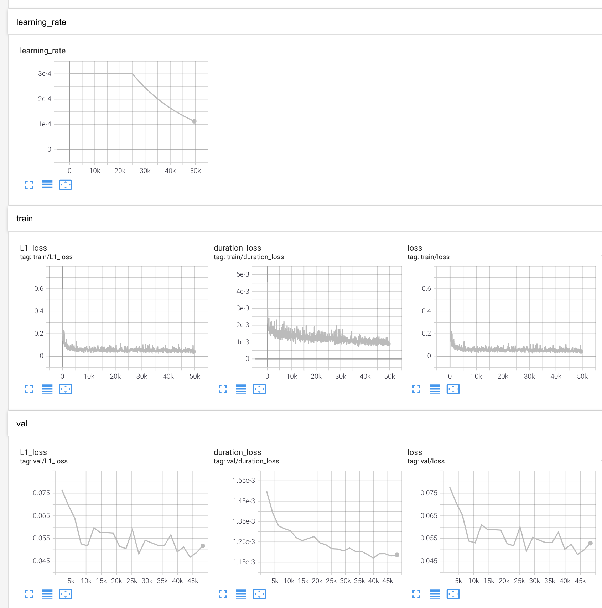
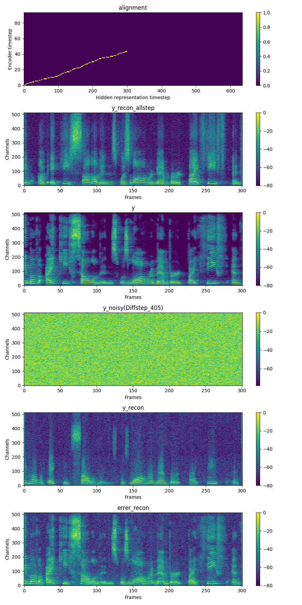

# WaveGrad 2 &mdash; Unofficial PyTorch Implementation

**WaveGrad 2: Iterative Refinement for Text-to-Speech Synthesis**<br>
Unofficial PyTorch+[Lightning](https://github.com/PyTorchLightning/pytorch-lightning) Implementation of Chen *et al.*(JHU, Google Brain), [WaveGrad2](https://arxiv.org/abs/2106.09660).<br>

##TODO
- [ ] MT + SpecAug
- [ ] Zoneout LSTM
- [ ] Sample pages
- [ ] Checkpoint release

## Requirements
- [Pytorch](https://pytorch.org/) 
- [Pytorch-Lightning](https://github.com/PyTorchLightning/pytorch-lightning)==1.2.10
- The requirements are highlighted in [requirements.txt](./requirements.txt).<br>
- We also provide docker setup [Dockerfile](./Dockerfile).<br>

## Datasets
The supported datasets are

- [LJSpeech](https://keithito.com/LJ-Speech-Dataset/): a single-speaker English dataset consists of 13100 short audio clips of a female speaker reading passages from 7 non-fiction books, approximately 24 hours in total.
- [AISHELL-3](http://www.aishelltech.com/aishell_3): a Mandarin TTS dataset with 218 male and female speakers, roughly 85 hours in total.
- etc.

We take LJSpeech as an example hereafter.
## Preprocessing
 
First, run 
```
python prepare_align.py -c preprocess.yaml
```
for some preparations.

As described in the paper, [Montreal Forced Aligner](https://montreal-forced-aligner.readthedocs.io/en/latest/) (MFA) is used to obtain the alignments between the utterances and the phoneme sequences.
Alignments for the LJSpeech and AISHELL-3 datasets are provided [here](https://drive.google.com/drive/folders/1DBRkALpPd6FL9gjHMmMEdHODmkgNIIK4?usp=sharing).
You have to unzip the files in ``preprocessed_data/LJSpeech/TextGrid/``.

After that, run the preprocessing script by
```
python preprocess.py -c preprocess.yaml
```

Alternately, you can align the corpus by yourself. 
Download the official MFA package and run
```
./montreal-forced-aligner/bin/mfa_align raw_data/LJSpeech/ lexicon/librispeech-lexicon.txt english preprocessed_data/LJSpeech
```
or
```
./montreal-forced-aligner/bin/mfa_train_and_align raw_data/LJSpeech/ lexicon/librispeech-lexicon.txt preprocessed_data/LJSpeech
```

to align the corpus and then run the preprocessing script.
```
python preprocess.py -c preprocess.yaml
```
## Training
- run `trainer.py`
```shell script
$ python trainer.py
```

- During training, tensorboard logger is logging loss, spectrogram and audio.
```shell script
$ tensorboard --logdir=./tensorboard --bind_all
```



## Inference
**Checkpoint file will be released!**

## Author
This code is implemented by
- Seungu Han at mindslab [hansw0326@mindslab.ai](mailto:hansw0326@mindslab.ai)
- Junhyeok Lee at mindslab [jun3518@mindslab.ai](mailto:jun3518@mindslab.ai)

## References
- Chen *et al.*, [WaveGrad 2: Iterative Refinement for Text-to-Speech Synthesis](https://arxiv.org/abs/2106.09660)
- Chen *et al.*,[WaveGrad: Estimating Gradients for Waveform Generation](https://arxiv.org/abs/2009.00713)
- Ho *et al.*, [Denoising Diffusion Probabilistic Models](https://arxiv.org/abs/2006.11239)

This implementation uses code from following repositories:
- [J.Ho's Official DDPM Implementation](https://github.com/hojonathanho/diffusion)
- [lucidrains' DDPM Pytorch Implementation](https://github.com/lucidrains/denoising-diffusion-pytorch)
- [ivanvovk's WaveGrad Pytorch Implementation](https://github.com/ivanvovk/WaveGrad)
- [lmnt-com's DiffWave Pytorch Implementation](https://github.com/lmnt-com/diffwave)
- [ming024's FastSpeech2 Pytorch Implementation](https://github.com/ming024/FastSpeech2)
- [yanggeng1995's EATS Pytorch Implementation](https://github.com/yanggeng1995/EATS)
- [mindslab's NU-Wave](https://github.com/mindslab-ai/nuwave)
- [Keith Ito's Tacotron implementation](https://github.com/keithito/tacotron)
- [NVIDIA's Tacotron2 implementation](https://github.com/NVIDIA/tacotron2)

The audio samples on our webpage(TBD) are partially derived from:
- [LJSpeech](https://keithito.com/LJ-Speech-Dataset/): a single-speaker English dataset consists of 13100 short audio clips of a female speaker reading passages from 7 non-fiction books, approximately 24 hours in total.

